# Interpolators: the maths

This page derives the model behind each `AngularRateInterpolator`. It's
theory only — for what these classes are, how to wire one into a reckoner,
and how look-ahead is handled at the code level, see the
[overview page](../interpolation.md).

Each interpolator's job is the same: given the body-frame angular rate at
the two samples bounding an integration step, `p0` at `t0` and `p1` at
`t1`, produce a function `w(t)` for `t0 <= t <= t1` that's a reasonable
model of what the true, continuously-varying rate was doing between them.
They differ only in what model of "reasonable" they use, and how much
information beyond `p0`/`p1` they draw on to build it.

## `TwoPointLinearInterpolator`

The simplest model: assume the rate varies linearly between the two known
endpoints. With `s = (t - t0) / (t1 - t0)`,

```
w(t) = p0 + s * (p1 - p0)
```

No other information is used or needed — this is the reference every other
model is compared against below.

## `ZeroOrderHoldInterpolator`

Assumes the rate stays fixed at its most recently known value for the
whole step:

```
w(t) = p0
```

This is a reasonable model exactly when the true rate doesn't change much
over one sampling interval — i.e. when the sampling rate is fast relative
to how quickly the body's angular rate actually varies. When that
assumption breaks down (a fast rotation sampled coarsely), holding the
rate constant increasingly misrepresents what happened during the step.

## `CentredCubicHermiteInterpolator`

### Why two points aren't enough to pick a unique curve

`p0` and `p1` alone are two constraints. Infinitely many curves pass
through two points — a straight line is only the simplest of them, not a
distinguished one. To narrow the family down to a single, specific curve,
more constraints are needed. A cubic polynomial has four free coefficients,
so it can absorb exactly four constraints: the value *and* the slope
(tangent) at each of the two endpoints. That's the cubic Hermite spline.

### The Hermite formula

Given values `p0`, `p1` and tangents `m0`, `m1` at `t0`, `t1`, reparametrise
time as `s = (t - t0) / span` where `span = t1 - t0`, so `s` runs from 0 to
1 across the step. The interpolant is a weighted sum of four cubic basis
functions:

```
h00(s) =  2s^3 - 3s^2 + 1
h10(s) =    s^3 - 2s^2 + s
h01(s) = -2s^3 + 3s^2
h11(s) =    s^3 - s^2

w(t) = h00(s)*p0 + h10(s)*span*m0 + h01(s)*p1 + h11(s)*span*m1
```

`h00`/`h01` weight the two endpoint values (`h00(0)=1, h00(1)=0` and vice
versa for `h01`), and `h10`/`h11` weight the two tangents. The tangent
terms are scaled by `span`: `m0`/`m1` are rates of change with respect to
real time `t`, but the basis functions are derivatives with respect to
`s`, and by the chain rule `d/ds = span * d/dt` — so an extra factor of
`span` converts the tangent into the right units for the `s`-parametrised
polynomial.

### Where the tangents come from: Catmull-Rom finite differences

The gyro never measures a derivative directly — only rate samples at
discrete times. So `m0` and `m1` are *estimated*, using one extra sample
of context beyond each endpoint: `before`, immediately preceding `p0`, and
`after`, immediately following `p1`. Each tangent is the secant slope
through the pair of samples straddling its endpoint:

```
m0 = (p1 - before) / (t1 - before.t)
m1 = (after - p0)  / (after.t - t0)
```

That is: `m0` is *not* the slope from `before` to `p0` — it's the slope of
the line spanning both of `p0`'s neighbours, `before` and `p1`, evaluated
at `p0`. Likewise `m1` uses `p0` and `after`, evaluated at `p1`. This is
the standard Catmull-Rom construction: it approximates the derivative at a
point using a centred difference over its two neighbours, rather than a
one-sided difference to just one of them.



**Worked example.** Four samples on one axis, arbitrary units:
`before(t=-1, v=2)`, `p0(t=0, v=5)`, `p1(t=1, v=9)`, `after(t=2, v=20)`.

```
m0 = (9 - 2) / (1 - (-1)) = 3.5
m1 = (20 - 5) / (2 - 0)   = 7.5
```

compared to the plain secant through just `p0`/`p1`, `(9-5)/(1-0) = 4`.
Since `m1 > secant > m0`, the neighbouring samples imply the rate is
accelerating through the step, and the Hermite curve bends to reflect
that — it dips slightly below the straight line near the middle of the
step, leaning into that curvature, before rising more steeply than the
line towards `p1`:


### The exact reduction to linear interpolation

When both tangents happen to equal the plain secant — `m0 = m1 = (p1-p0)/span`
— the Hermite formula collapses exactly to
`TwoPointLinearInterpolator`'s formula, not merely approximately. This
follows from two identities of the basis functions:

```
h00(s) - h10(s) - h11(s) = 1 - s
h10(s) + h01(s) + h11(s) = s
```

Substituting `m0 = m1 = secant = (p1-p0)/span` into the Hermite sum and
collecting terms by these identities gives `w(s) = (1-s)*p0 + s*p1` —
exactly the linear blend. This isn't a coincidence: it's what makes the
boundary behaviour described below mathematically sound rather than an
arbitrary special case.

## How we handle look-ahead windows

`TwoPointLinearInterpolator` and `ZeroOrderHoldInterpolator` need nothing
beyond the step's own two endpoint samples — their formulas are purely
local to `[t0, t1]`.

`CentredCubicHermiteInterpolator` needs one sample before the step's start
and one after its end, because — as above — no derivative is ever directly
measured; estimating one at `p0` or `p1` requires a neighbour on the far
side to form a secant through. That's an intrinsically non-local
requirement: to know how the rate is curving at the step's own boundary,
information from just past that boundary is needed.

At a sequence boundary where such a neighbour genuinely doesn't exist —
the very first or last sample in a run — there's no centred estimate
available, so the tangent estimate falls back to the one-sided case: the
step's own plain secant. By the exact-reduction identity above, using the
plain secant as *both* tangents is precisely what makes the curve equal
`TwoPointLinearInterpolator`'s output. So the model doesn't merely avoid
failing at a boundary — it degrades to the simplest applicable model
exactly, with no discontinuity in behaviour between "one neighbour
missing" and "both present".
